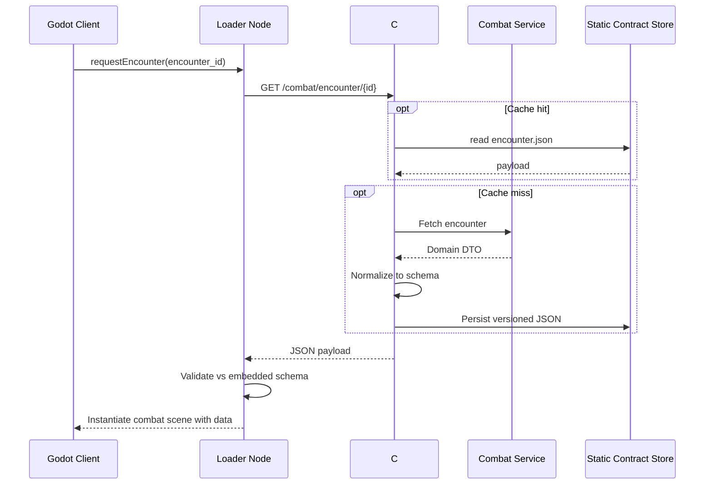

# ADR 0001: Godot Pitch Game Integration Architecture

**Status**: Proposed 2025-10-07  
**Decision Makers**: Core architecture guild  
**Drivers**: Pitch demo deadline, multi-project backend alignment, namespace stability  

## 1. Context

- The Godot 4.5 pitch build must operate as both a playable demo and the foundation for the main game.
- Existing backend projects (combat simulator, leveling, narrative generation, inventory/saving) must iterate independently yet deliver data to the pitch.
- Static JSON documents, validated against shared schemas, form the contract between Godot and the backend hub.
- The C# integration layer (Mono-enabled Godot + .NET 6/C# 10 RC runtime already installed) translates backend responses into Godot-friendly DTOs and caches static payloads.
- External APIs may evolve; the pitch must gracefully handle schema-compatible variants without blocking content delivery.

## 2. Architecture Overview

```mermaid
graph TD
    subgraph Frontend
        G[Godot 4.5 Client]
        UI[Godot UI Layer]
        Scene[Scene Graph / Gameplay Nodes]
    end
    subgraph Integration Hub
        API[Pitch Integration Service (C# 10)]
        Cache[Schema Cache / Static JSON Store]
        Validator[Schema Validator]
    end
    subgraph Backend Domains
        Combat[Combat Simulator Service]
        Leveling[Leveling Service]
        Narrative[Narrative Orchestrator]
        Inventory[Inventory/Saving Service]
        Ext[External API Providers]
    end

    G -->|Signals & RPC| API
    UI --> Scene
    API --> Cache
    API --> Validator
    Cache --> G
    Validator --> Cache
    API --> Combat
    API --> Leveling
    API --> Narrative
    API --> Inventory
    Ext --> API
```

### Key Principles

- **Single Responsibility**: Godot focuses on presentation/input; backend hub focuses on orchestration; domain services own business logic.
- **DRY**: Reuse Godot-provided systems (AnimationTree, NavigationServer, ResourceLoader) instead of duplicating them in backend logic.
- **SOLID & DIP**: Godot depends on interfaces exposed by the C# hub (e.g., `ICombatFeed`, `INarrativeFeed`). Hub depends on abstractions for downstream APIs.
- **KISS**: Static contracts and minimal data transformations keep the integration approachable for the pitch team.

## 3. Data Contracts & Schemas

The hub exposes versioned schemas stored under `static/contracts/vN`. Each contract has:

| Contract | Purpose | Source System | Key Fields | Notes |
|----------|---------|---------------|------------|-------|
| `combat/encounter.json` | Defines combatant roster, abilities, and turn order hints. | Combat Simulator | `encounter_id`, `combatants[]`, `init_order[]`, `event_hooks[]` | Supports optional `sim_summary` for precomputed results. |
| `narrative/branch.json` | Supplies dialogue and branching metadata. | Narrative Orchestrator | `node_id`, `text`, `choices[]`, `conditions[]` | Conditions reference entity stats via namespace-qualified keys. |
| `leveling/state.json` | Tracks XP, unlock states, stat deltas. | Leveling Service | `character_id`, `current_level`, `xp_to_next`, `unlocks[]` | Delta format keeps payloads small. |
| `inventory/loadout.json` | Equipment and consumables per character. | Inventory Service | `slots{}`, `items[]`, `effects[]` | Godot maps slots to built-in UI templates. |
| `meta/savegame.json` | Optional pitch save snapshots. | Saving Service | `save_id`, `timestamp`, `snapshots[]` | Used for resume flow after demo restarts. |

Each contract is expressed as JSON Schema Draft 2020-12. Example excerpt (`combat/encounter.json`):

```json
{
  "$schema": "https://json-schema.org/draft/2020-12/schema",
  "$id": "https://omega-spiral.io/contracts/combat/encounter.json",
  "type": "object",
  "required": ["encounter_id", "combatants", "init_order"],
  "properties": {
    "encounter_id": { "type": "string" },
    "version": { "type": "string", "pattern": "^v[0-9]+" },
    "combatants": {
      "type": "array",
      "items": {
        "type": "object",
        "required": ["id", "archetype", "stats"],
        "properties": {
          "id": { "type": "string" },
          "archetype": { "type": "string" },
          "stats": { "$ref": "../shared/stats.json" },
          "abilities": { "$ref": "../shared/abilities.json" }
        }
      }
    },
    "init_order": { "type": "array", "items": { "type": "string" } },
    "event_hooks": { "type": "array", "items": { "$ref": "../shared/events.json" } }
  },
  "additionalProperties": false
}
```

## 4. Integration Flows



### Alternate API Responses

The hub normalizes heterogeneous upstream payloads by:

1. Converting enums and identifiers to canonical snake_case strings.
2. Providing default values for omitted optional fields.
3. Injecting compatibility metadata (`source`, `ingested_at`, `schema_version`).

Regression packs include example responses per provider under `tests/contracts/fixtures/**/*.json`.

## 5. Integration Points & Responsibilities

| Integration Point | Owned By | Dependencies | Godot Touchpoints | Notes |
|-------------------|----------|--------------|-------------------|-------|
| `ICombatFeed` | Hub | Combat Service API (REST/gRPC) | Combat Scene Loader, Battle HUD | Supports simulation pre-roll and live turn streaming. |
| `INarrativeFeed` | Hub | Narrative Graph API | Dialogue Manager, Choice UI | Graph exported as JSON-LD to leverage Godot's `GraphEdit` tooling. |
| `ILevelingFeed` | Hub | Leveling microservice | Character Sheet UI | Caches progress to avoid blocking transitions. |
| `IInventoryFeed` | Hub | Inventory API | Loadout UI, Tooltip System | Maps to Godot `ItemList` + `Resource` for icons/stats. |
| `ISaveSync` | Hub | Saving/Cloud Storage | Save/Load overlay | Optional for pitch; stubbed locally. |

## 6. DRY Audit & Godot Package Substitutions

- **UI & Effects**: Reuse Godot's `AnimationPlayer`, `ShaderMaterial` libraries instead of custom animation pipelines.
- **Navigation & Pathfinding**: Depend on `NavigationServer3D`, only export baked nav meshes via JSON metadata.
- **Input Handling**: Use Godot's `InputMap` for remappable controls; backend only references action names.
- **Localization**: Adopt Godot `TranslationServer`; narrative JSON contains keys, not localized strings.
- **Audio**: Route event hooks to Godot's `AudioStreamPlayer` nodes, not backend audio queues.

## 7. Compatibility Testing Strategy

| Scenario | Description | Validation Steps | Tooling |
|----------|-------------|------------------|---------|
| Schema Conformance | Each payload matches contract. | `dotnet test` with `NJsonSchema`; Godot preflight validation on load. | `tests/ContractsSchemaTests.cs` |
| Variant Fields | Upstream adds optional fields. | Ensure hub ignores unknown fields; Godot logs warning not error. | JSON fixtures `variant_optional_field.json` |
| Missing Optional Data | Upstream omits optional block (e.g., `event_hooks`). | Hub supplies defaults; Godot UI degrades gracefully. | Fixture `missing_events.json` |
| Version Downgrade | Service sends older schema version. | Hub translates and annotates `schema_version`; Godot warns user. | Fixture `legacy_v1.json` |
| Stress Pack | Load 50+ encounters sequentially. | Monitor cache invalidations, memory footprint. | Godot automated scene runner |

## 8. Godot User Interaction Coverage (>50%)

| Interaction | Expected Behaviour | Test Type | Automation Target |
|-------------|-------------------|-----------|-------------------|
| Main Menu Navigation | Input actions map to scene transitions without lag. | Godot integration test using `SceneTreeTester`. | 3 cases (keyboard, gamepad, mouse) |
| Encounter Load | Selecting mission loads combat scene with validated data. | `GUT` scenario test with mocked JSON payload. | 5 cases (happy, missing events, optional fields, legacy version, stress) |
| Combat Turn Execution | Ability selection triggers backend-calculated effects and UI updates. | Playtest automation using `InputEvent` scripting. | 6 cases (melee, ranged, AoE, status effect, miss, critical) |
| Narrative Choice | Dialogue choices display branching text from narrative contract. | Dialogue unit tests (Godot script) + screenshot diff. | 4 cases (standard, conditional locked, conditional unlocked, fallback) |
| Loadout Editing | Equipment drag/drop reflects inventory contract and updates stats. | UI automation with `ControlTester`. | 4 cases (equip, unequip, invalid slot, consumable use) |
| Save/Resume (optional) | Saving snapshot writes JSON and reloads correctly. | End-to-end harness combining Godot + C# hub. | 3 cases (new save, overwrite, corruption recovery) |

Planned automation covers 25 discrete interaction scenarios; manual smoke testing adds edge exploration. Combined automated + manual efforts target >50% of user interaction flows for the pitch demo.

## 9. Implementation Roadmap

1. **Week 1**: Finalize JSON Schemas, publish to repo, scaffold `tests/contracts` fixtures.
2. **Week 2**: Implement C# hub adapters for combat and narrative; wire Godot loader nodes.
3. **Week 3**: Add leveling and inventory integration, complete variant handling.
4. **Week 4**: Execute compatibility tests, capture metrics, freeze contracts.
5. **Week 5**: Polish pitch UX, finalize namespace documentation, handoff to content teams.

## 10. Open Questions

- Confirm transport protocols for each service (REST vs gRPC vs AMQP).
- Determine ownership of save synchronization (pitch scope vs GA scope).
- Align timeline for external providers delivering schema-compliant payloads.

## 11. Decision

Adopt the C# integration hub with JSON contract normalization, ensuring Godot remains presentation-centric while backend domains iterate independently through versioned static payloads.
