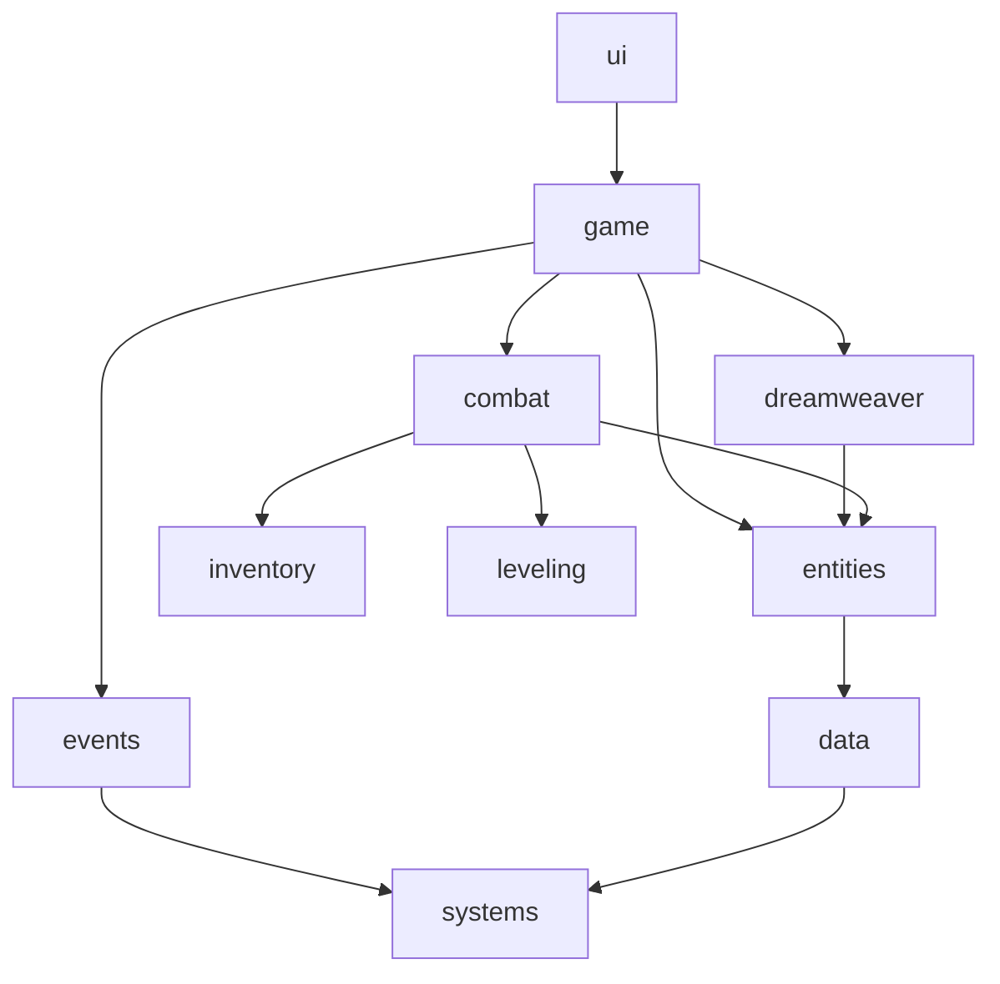

# ADR 0002: Namespace Review Feedback

**Status**: Proposed 2025-10-07
**Audience**: Gameplay, backend, tooling teams

## 1. Snapshot of Current Structure

- Top-level namespaces cleanly align to application layers.
- `combat`, `inventory`, and `leveling` depend on `entities` for state containers, meeting Single Responsibility.
- `events` sits beneath `game`, enabling cross-domain messaging without circular coupling.

## 2. Strengths

- **Clear Dependency Direction**: Higher-level namespaces depend on lower-level ones (e.g., `game` → `combat`).
- **Interface-first Boundaries**: `game` communicates with `dreamweaver` and `combat` via interfaces (`IDreamweaver`, `ICombatSystem`).
- **Adapter Emphasis**: Existing adapters (`NarrativeAdapter`, `CombatAdapter`) enforce translation between models.
- **Extensibility Hooks**: The `external` namespace allows third parties to extend jobs/abilities without mutating core code.

## 3. Gaps & Risks

| Area | Observation | Impact | Recommendation |
|------|-------------|--------|----------------|
| Naming Drift | Mix of nouns (`combat`) and verbs (`leveling`). | Onboarding friction, inconsistent documentation. | Adopt noun-based namespace names (e.g., rename `leveling` → `progression`). |
| Inventory Coupling | `combat` directly references `inventory::InventoryManager` for loadouts. | Violates Interface Segregation; hard to mock. | Introduce `combat::ILoadoutProvider` consumed by combat; implemented in `inventory`. |
| Data Layer Entanglement | `entities` reaches into `data` for persistence helpers in some utilities (per design notes). | Potential for circular dependencies when scaling. | Relocate persistence helpers into `data::repositories` and inject interfaces into `entities` factories. |
| Event Taxonomy | `events` namespace mixes gameplay events and infra events. | Hard to filter subscribers; risk of collisions. | Split into `events::gameplay` and `events::system`. Provide shared base interface in `events::core`. |
| Testing Surface | No dedicated `tests` namespace or harness package. | Inconsistent test placement. | Establish `tests::<namespace>` sub-namespaces or separate test module referencing interfaces only. |

## 4. Naming & Organization Guidelines

1. **Namespace Hierarchy**
   - Use plural nouns for domains (`entities`, `systems`, `adapters`).
   - Use suffixes for roles: `::api`, `::impl`, `::adapters`, `::contracts`.
   - Reserve `::core` for minimal cross-cutting utilities (small and stable).

2. **Interface Naming**
   - Prefix interfaces with `I` (existing convention) and keep them in `::<domain>::api`.
   - Provide narrow interfaces tailored to consuming namespaces (Interface Segregation Principle).

3. **Adapter Placement**
   - Place adapters in `::<consumer>::adapters` to signal ownership.
   - Ensure adapters depend only on contracts, not concrete implementations.

4. **External Extensions**
   - Document expectations for the `external` namespace (e.g., `external::jobs`, `external::abilities`).
   - Provide facade interfaces in core namespaces for extension points (e.g., `combat::IAbilityEffect`).

## 5. Action Items Before Freeze

- [ ] Rename `leveling` namespace to `progression` and update references.
- [ ] Create `inventory::api::ILoadoutProvider`; refactor `combat` to depend on it.
- [ ] Move persistence helpers into `data::repositories`; expose via interfaces.
- [ ] Split `events` into `events::core`, `events::gameplay`, `events::system`.
- [ ] Publish namespace style guide (this document) to project wiki.
- [ ] Align tests under a single module referencing interfaces only.

## 6. Communication Plan

- Present summary slide in next architecture sync (include Mermaid overview and action items).
- Share this ADR with feature teams and request sign-off by 2025-10-14.
- Add checklist items to Jira epic `ARCH-045` for tracking.

## 7. Open Questions

- Do external partners require additional namespaces beyond `external` (e.g., plugin ecosystem)?
- Should `systems` namespace absorb shared math/utility libraries or remain infrastructure-only?
- Is there appetite for automated namespace dependency checks (e.g., include pathlint in CI)?
