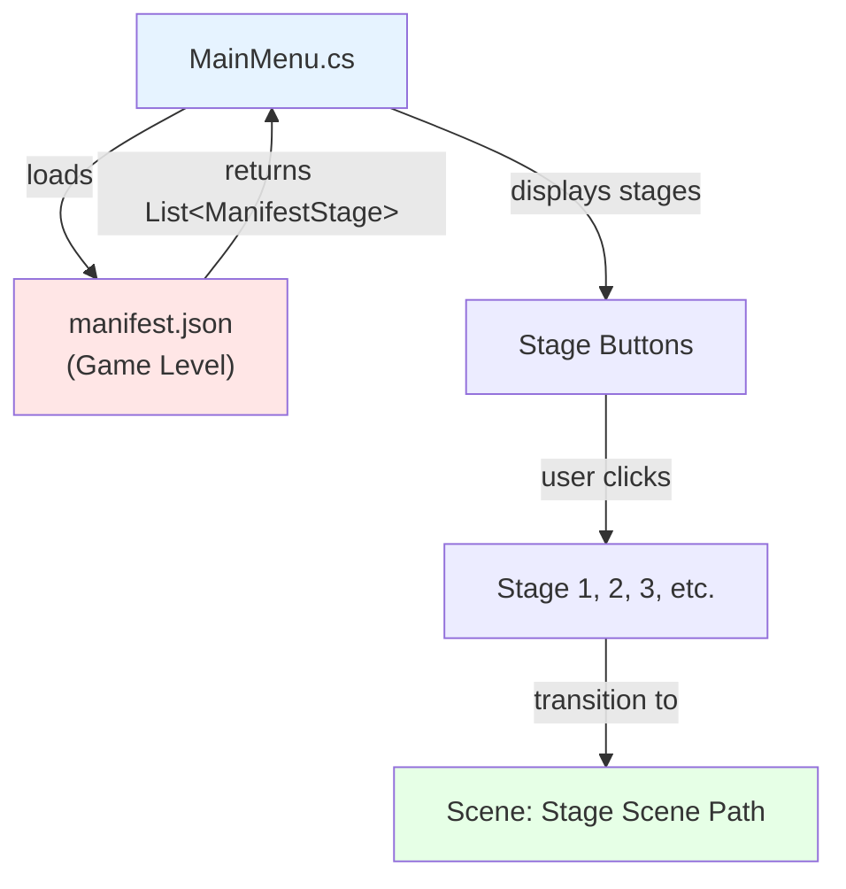
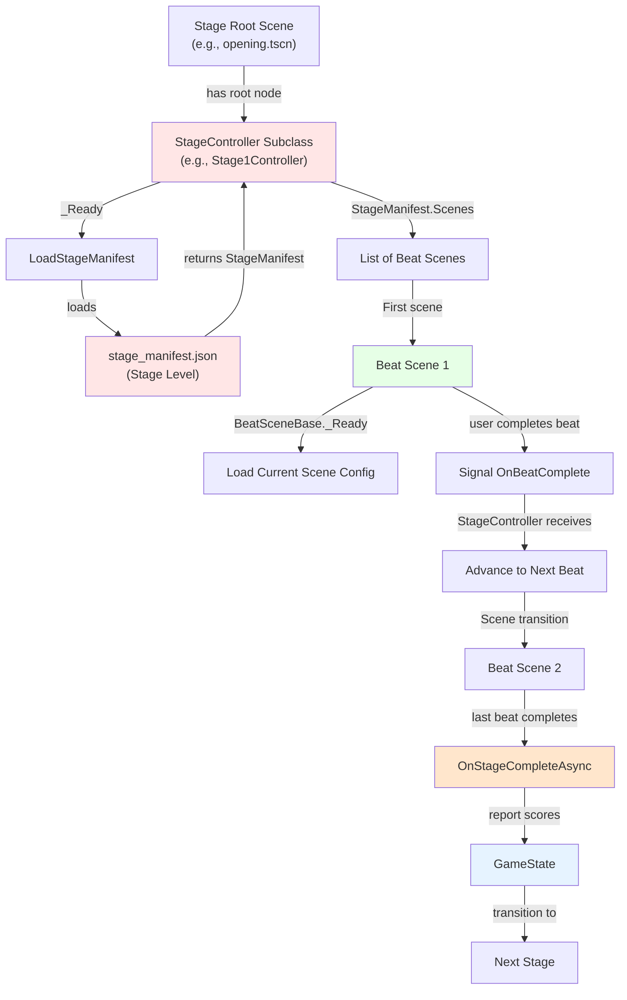
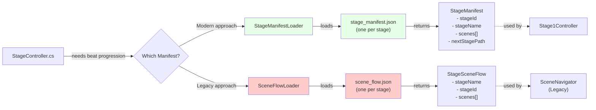
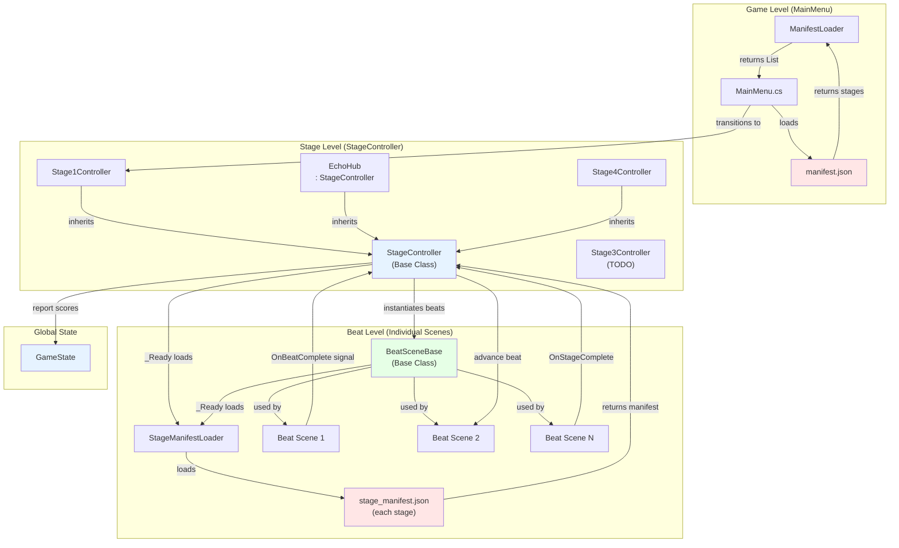
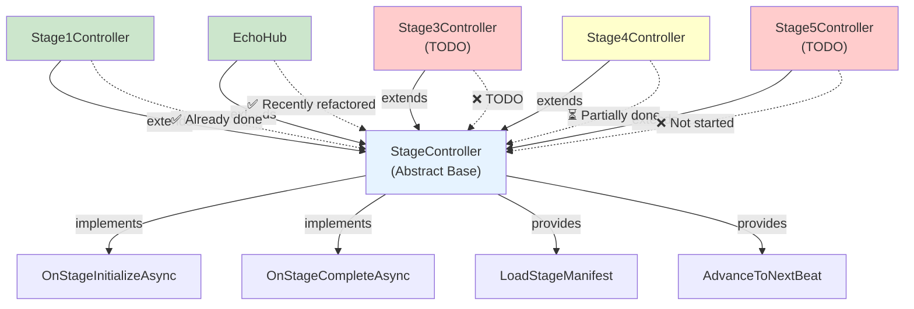
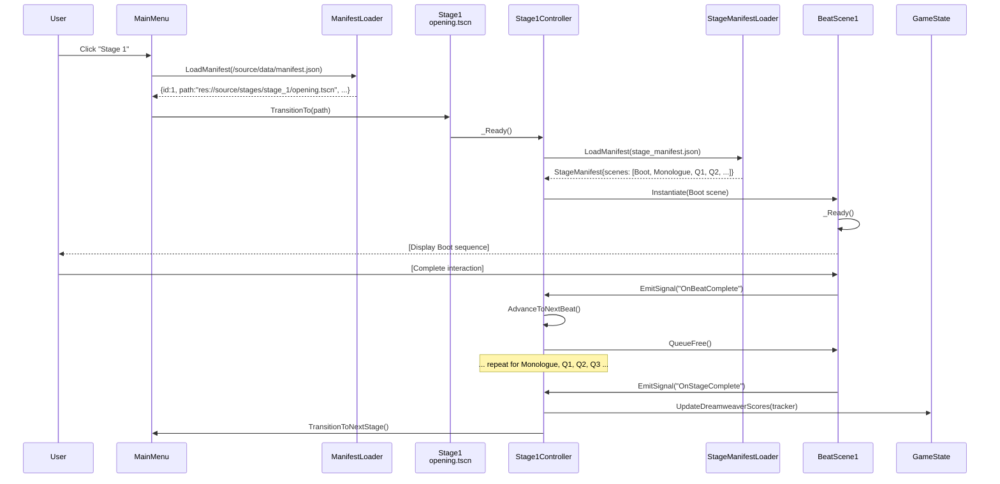

# Stage Architecture Overview

This document provides visual representations of how all the loader and controller components work together to orchestrate the game's stage progression system.

## 1. Game Level - Stage Selection Flow



**What happens:**
- `MainMenu` uses `ManifestLoader` to load `/source/data/manifest.json`
- Manifest contains list of all 5 stages with their root scene paths
- When user clicks a stage, MainMenu transitions to that stage's root scene

---

## 2. Stage Level - Beat Progression Flow



**What happens:**
1. Stage root scene loads with `StageController` subclass as root node
2. `StageController._Ready()` calls `LoadStageManifest()` 
3. `StageManifestLoader` loads `stage_manifest.json` from that stage's data folder
4. Manifest defines all beat scenes in order for that stage
5. Each beat scene inherits from `BeatSceneBase`
6. When a beat completes, it signals back to `StageController`
7. `StageController` advances to next beat (or completes stage)
8. On stage completion, scores are reported to `GameState`

---

## 3. Scene Flow Loaders (Legacy vs Current)



**Key Difference:**
- **`StageManifestLoader` + `stage_manifest.json`** = Modern, current approach
- **`SceneFlowLoader` + `scene_flow.json`** = Legacy approach, still in codebase
- Both do the same thing (define beat progression), different JSON format

---

## 4. Complete Architecture: Game → Stage → Beat



---

## 5. Loader Responsibility Matrix

| Loader | Loads | Returns | Used By | Scope |
|--------|-------|---------|---------|-------|
| **ManifestLoader** | `/source/data/manifest.json` | `List<ManifestStage>` | `MainMenu.cs` | **GAME LEVEL** - Stage selection |
| **StageManifestLoader** | `stage_manifest.json` (each stage) | `StageManifest` | `StageController` | **STAGE LEVEL** - Beat progression within a stage |
| **SceneFlowLoader** | `scene_flow.json` (each stage) | `StageSceneFlow` | `SceneNavigator` | **STAGE LEVEL** - Legacy beat progression |
| **NarrativeDataLoader** | `narrative_data.json` (Stage 1) | `NarrativeSceneData` | `NarrativeSceneDirector` | **BEAT LEVEL** - Dialogue/narrative content within a beat scene |

---

## 6. StageController Hierarchy (Target State)



---

## 7. Data Flow: User Clicks Stage 1



---

## 8. File Organization

```
/source/
├── /data/
│   ├── manifest.json ............................ GAME LEVEL
│   └── /stages/
│       ├── /stage_1/
│       │   ├── stage_manifest.json
│       │   └── /narrative_data/
│       │       └── narrative_data.json
│       ├── /stage_2/
│       │   └── stage_manifest.json
│       ├── /stage_3/
│       │   └── stage_manifest.json
│       ├── /stage_4/
│       │   └── stage_manifest.json
│       └── /stage_5/
│           └── stage_manifest.json
│
├── /stages/
│   ├── /stage_1/
│   │   ├── opening.tscn (root: Stage1Controller)
│   │   ├── Stage1Controller.cs
│   │   └── /scenes/
│   │       ├── boot_sequence.tscn (root: BeatSceneBase)
│   │       ├── opening_monologue.tscn (root: BeatSceneBase)
│   │       └── ...
│   ├── /stage_2/
│   │   ├── echo_hub.tscn (root: EchoHub : StageController)
│   │   ├── EchoHub.cs
│   │   └── /scenes/
│   │       └── ...
│   ├── /stage_3/
│   │   ├── stage_3_main.tscn
│   │   ├── Stage3Controller.cs (TODO)
│   │   └── /scenes/
│   │       └── ...
│   ├── /stage_4/
│   │   ├── stage_4_main.tscn
│   │   ├── Stage4Controller.cs
│   │   ├── Stage4BeatExecutor.cs
│   │   ├── Stage4PartyService.cs
│   │   ├── Stage4AffinityService.cs
│   │   └── /scenes/
│   │       └── ...
│   └── /stage_5/
│       └── (empty - not yet implemented)
│
└── /scripts/
    └── /infrastructure/
        ├── ManifestLoader.cs ..................... GAME LEVEL
        ├── StageController.cs ................... STAGE LEVEL (base)
        ├── StageManifestLoader.cs ............... STAGE LEVEL
        ├── SceneFlowLoader.cs ................... STAGE LEVEL (legacy)
        ├── BeatSceneBase.cs ..................... BEAT LEVEL (base)
        ├── NarrativeDataLoader.cs ............... BEAT LEVEL (Stage 1 specific)
        └── GameState.cs ......................... GLOBAL
```

---

## 9. Quick Reference: What Loads What

**At Game Start:**
```
MainMenu.cs 
  → ManifestLoader.LoadManifest("/source/data/manifest.json")
    → Returns: [Stage 1, Stage 2, Stage 3, Stage 4, Stage 5]
```

**When Stage 1 Loads:**
```
Stage1Controller._Ready() 
  → StageManifestLoader.LoadManifest("res://source/stages/stage_1/stage_manifest.json")
    → Returns: StageManifest with scenes=[Boot, Monologue, Q1, Q2, Q3, Secret, SecretReveal, Name, ThreadLock]
```

**When Boot Scene Loads:**
```
BootSequence._Ready() (extends BeatSceneBase)
  → StageManifestLoader.LoadManifest(StageManifestPath)
    → Returns: Current scene config for "Boot" beat
  → NarrativeDataLoader.LoadNarrativeData(narrativeDataPath)
    → Returns: Dialogue and scene data for Boot scene
```

---

## 10. Refactoring Status

| Stage | Root Scene | Controller Class | Status | Notes |
|-------|-----------|------------------|--------|-------|
| **1** | `opening.tscn` | `Stage1Controller` | ✅ **DONE** | Correctly uses `StageController` pattern |
| **2** | `echo_hub.tscn` | `EchoHub : StageController` | ✅ **DONE** | Recently refactored to inherit from `StageController` |
| **3** | `stage_3_main.tscn` | `Stage3Main` (Node2D) | ❌ **TODO** | Needs to become `Stage3Controller : StageController` |
| **4** | `stage_4_main.tscn` | `Stage4Controller` | ⏳ **PARTIAL** | Controller created, old `Stage4Main.cs` corrupted, needs cleanup |
| **5** | (Not started) | (Not started) | ❌ **TODO** | Folder exists but not implemented |

---

## 11. Key Insight: Three Levels of Orchestration

```
┌─────────────────────────────────────────────────────────────┐
│  LEVEL 1: GAME ORCHESTRATION (MainMenu)                     │
│  ─────────────────────────────────────────────────────────  │
│  Uses: ManifestLoader                                        │
│  Loads: manifest.json (defines 5 stages)                     │
│  Decides: Which stage to load                                │
│  Responsible: Stage selection UI, transitions to stage root  │
└─────────────────────────────────────────────────────────────┘
                           ↓
┌─────────────────────────────────────────────────────────────┐
│  LEVEL 2: STAGE ORCHESTRATION (StageController)             │
│  ─────────────────────────────────────────────────────────  │
│  Uses: StageManifestLoader                                   │
│  Loads: stage_manifest.json (defines beats within stage)     │
│  Decides: Which beat scene to load, when to advance          │
│  Responsible: Beat progression, score accumulation, next     │
│               stage transition                               │
└─────────────────────────────────────────────────────────────┘
                           ↓
┌─────────────────────────────────────────────────────────────┐
│  LEVEL 3: BEAT ORCHESTRATION (BeatSceneBase)                │
│  ─────────────────────────────────────────────────────────  │
│  Uses: NarrativeDataLoader, other beat-specific loaders      │
│  Loads: Beat-specific data (dialogue, choices, etc.)         │
│  Decides: How to present content, when beat is complete      │
│  Responsible: User interaction, beat presentation            │
└─────────────────────────────────────────────────────────────┘
```

This is the **separation of concerns** architecture that makes each level only care about its own orchestration!
