# Terminal Window System - TDD Test Checklist

_References: `gdunit4-tools.instructions.md`, `integration-testing.md`, `paramerized_tests.md`, `gdUnit4Net-API.mdx`, `scene-runner.instructions.md`_

---

## Overview
The terminal window is a reusable Ui component used throughout the game:
- **Stage Select Menu**: Full-screen menu interface
- **NPC Dialogs**: Smaller conversational windows
- **Settings Screens**: Full-screen configuration interfaces
- **Stage Content**: Various narrative presentation windows

---

C# Structure
Style Managers (Apply dynamic styling)
FrameStyle.cs - Sets border color/thickness on TerminalFrame
BackgroundStyle.cs - Sets bezel color + CRT shader params
ContentStyle.cs - Sets typography, colors, spacing
Main Script
TerminalWindow.cs - Composes scenes, manages layout, delegates styling

---

```mermaid
graph TD
    subgraph "Reusable Components"
        Frame["📦 frame.tscn<br/>Just the border<br/>Red 4px frame<br/>ContentArea placeholder"]
        Background["🎨 background.tscn<br/>Bezel + CRT overlay<br/>Dark gray, scanlines<br/>Independent layer"]
        Content["📝 content.tscn<br/>Header/Body/Input<br/>Pure layout structure<br/>No styling"]
    end

    subgraph "Composition Templates"
        Dialog["🗨️ dialog_template.tscn<br/>Frame + Background + Content<br/>Generic NPC/system dialog<br/>Reused everywhere"]
        Terminal["💻 terminal_window.tscn<br/>Frame + Background + Content<br/>Terminal-specific behavior"]
    end

    subgraph "Stage Examples"
        Stage1["🎮 Stage 1<br/>Loads multiple dialogs<br/>Each uses dialog_template<br/>Different content only"]
        MainMenu["🎮 Main Menu<br/>Uses same dialog_template<br/>Different styling params"]
    end

    Frame --> Dialog
    Background --> Dialog
    Content --> Dialog

    Frame --> Terminal
    Background --> Terminal
    Content --> Terminal

    Dialog --> Stage1
    Dialog --> MainMenu
    Terminal --> Stage1

    style Frame fill:#e1f5ff
    style Background fill:#f3e5f5
    style Content fill:#e8f5e9
    style Dialog fill:#fff3e0
    style Terminal fill:#fff3e0
    style Stage1 fill:#fce4ec
    style MainMenu fill:#fce4ec
```

## Phase 1: Terminal Window Architecture (Frame-Constrained Content)

### Core Principle: Frame-Constrained Content
The terminal frame establishes the maximum bounds. Inner content must always fit within the frame, adapting to whatever size the frame is configured for (400x300 dialog to 3840x2160 full-screen).

### Frame Boundary Enforcement
- [ ] Inner content width never exceeds terminal frame width
- [ ] Inner content height never exceeds terminal frame height
- [ ] Content margins are calculated relative to frame dimensions (not viewport)
- [ ] Frame acts as hard boundary - content clips or scrolls if necessary
- [ ] Content positioning is relative to frame edges, not viewport edges

### Frame Size as Content Constraint
- [ ] At 400x300 frame: Content adapts to fit within 400x300 bounds
- [ ] At 1920x1080 frame: Content utilizes full 1920x1080 space appropriately
- [ ] At 3840x2160 frame: Content scales to use available space without exceeding bounds
- [ ] Frame resize dynamically constrains content in real-time
- [ ] Content never renders outside frame boundaries at any frame size

### Content-to-Frame Relationship
- [ ] Content center aligns with frame center (not viewport center)
- [ ] Content margins scale with frame size (≥8% of frame dimensions)
- [ ] Frame decorations create safe zone - content stays clear of borders
- [ ] Content adapts proportionally when frame size changes
- [ ] Visual hierarchy maintains balance within frame constraints

### Frame-Constrained Centering Tests
- [ ] Content horizontal center matches frame horizontal center (ratio-based)
- [ ] Content vertical center matches frame vertical center (ratio-based)
- [ ] Centering maintains accuracy when frame resizes
- [ ] Nested elements center within their parent containers within frame
- [ ] Centering works at extreme frame sizes (400x300 to 3840x2160)

### Frame-Constrained Spacing Tests
- [ ] Content margins ≥8% of frame dimensions (not viewport)
- [ ] Internal spacing scales with frame size
- [ ] No hard-coded pixel values - all spacing relative to frame
- [ ] Spacing maintains visual balance within frame constraints
- [ ] Element relationships preserve hierarchy regardless of frame size

### Frame-Constrained Overflow Protection
- [ ] Text content fits within frame width at all frame sizes
- [ ] Interactive elements remain within frame bounds
- [ ] Content scrolls when exceeding frame height
- [ ] No content clipping outside frame boundaries
- [ ] Overflow indicators appear when content exceeds frame dimensions

## Phase 2: Content Management (Frame-Aware Adaptation)

### Frame Size Awareness
- [ ] Content layout adapts based on current frame dimensions
- [ ] Content reflows when frame size changes
- [ ] Content maintains usability within frame constraints
- [ ] Frame size determines content density and spacing
- [ ] Content scales appropriately for frame size (not viewport size)

### Dynamic Frame Response
- [ ] Content repositions instantly when frame resizes
- [ ] Content maintains proportions relative to new frame size
- [ ] No visual artifacts during frame size transitions
- [ ] Content state preserved during frame size changes
- [ ] Smooth transitions when frame size changes

## Phase 2: Content Management (Terminal Window Content)

### Dynamic Content Adaptation
- [ ] Window accepts different content types (text, buttons, images, mixed)
- [ ] Content layout adapts based on window size automatically
- [ ] Content maintains proper spacing regardless of amount
- [ ] Window handles empty content gracefully
- [ ] Window handles overflow content with appropriate Ui patterns

### Content State Management
- [ ] Window preserves content state during resize operations
- [ ] Content focus/selection maintains during dynamic changes
- [ ] Window handles content updates without visual glitches
- [ ] Content transitions are smooth and professional
- [ ] Window maintains content integrity across size changes

## Phase 3: Visual Effects & Aesthetics

### Shader Effects Tests
- [ ] Phosphor effect renders correctly at all window sizes
- [ ] Scanline effect scales appropriately with window dimensions
- [ ] Glitch effects maintain visual impact across sizes
- [ ] Shader effects don't interfere with content readability
- [ ] Effects performance remains acceptable at all sizes

### Terminal Aesthetics
- [ ] Window maintains retro-futuristic visual identity at all sizes
- [ ] Border decorations scale proportionally
- [ ] Color scheme remains consistent across sizes
- [ ] Glow effects adapt to window size appropriately
- [ ] Visual noise/texture scales with window dimensions

## Phase 4: Accessibility & Usability

### Size-Aware Accessibility
- [ ] Minimum window size (400x300) maintains full accessibility
- [ ] Touch targets scale appropriately (minimum 44px)
- [ ] Text remains readable at all sizes (minimum 12px, contrast maintained)
- [ ] Focus indicators remain visible at all sizes
- [ ] Keyboard navigation works at all window sizes

### Content Accessibility
- [ ] Content hierarchy remains clear at all sizes
- [ ] Interactive elements maintain proper spacing
- [ ] Color contrast ratios preserved across sizes
- [ ] Screen reader compatibility maintained
- [ ] Motor accessibility considerations addressed

## Phase 5: Interaction & Navigation

### Input Handling
- [ ] Mouse/touch interactions work at all window sizes
- [ ] Keyboard navigation functions properly regardless of size
- [ ] Gamepad input adapts to window context
- [ ] Focus management works across size changes
- [ ] Input responsiveness maintained at all sizes

### Window Management
- [ ] Window can be resized during use without breaking interactions
- [ ] Content remains interactive during resize operations
- [ ] Focus transfers correctly when window changes size
- [ ] Modal behaviors work at different window sizes
- [ ] Window close/minimize/maximize functions work appropriately

## Phase 6: Integration & Performance

### Multi-Context Integration
- [ ] Window works as stage select menu (full screen)
- [ ] Window works as NPC dialog (small, centered)
- [ ] Window works as settings screen (full screen, complex content)
- [ ] Window works for stage content presentation (various sizes)
- [ ] Window integrates with different game contexts seamlessly

### Performance Tests
- [ ] Window renders efficiently at all supported sizes
- [ ] Shader effects maintain frame rate at maximum size
- [ ] Content loading/rendering performs well
- [ ] Memory usage remains reasonable across sizes
- [ ] Window doesn't cause performance degradation in game

## Implementation Notes

**Frame-Constrained Testing Strategy:**
- Test each requirement at multiple frame sizes: 400x300, 800x600, 1280x720, 1920x1080, 2560x1440
- Use `terminalFrame.GetRect()` as the boundary reference (not viewport)
- Verify content dimensions ≤ frame dimensions
- Test dynamic frame resizing during test execution
- Use ratios: `contentWidth / frameWidth ≤ 0.92` (allowing for margins)

**Key Distinction:**
- **Viewport**: The Godot window/screen size (can be larger than frame)
- **Frame**: The terminal window boundary (content must stay within this)
- **Content**: Adapts to fit within frame, never exceeding frame bounds

**Multi-Size Testing Strategy:**
- Test each requirement at minimum size (400x300) and maximum size (2560x1440)
- Use parameterized tests with different frame dimensions
- Verify proportional relationships hold across all frame sizes
- Test edge cases: extreme aspect ratios, minimum/maximum frame sizes

**Layout Measurement:**
- Use `Control.GetGlobalRect()` for absolute positioning
- Use `Control.Size` for dimensions
- Use `Rect2.GetCenter()` for center point calculations
- Use ratios and percentages for proportional testing (e.g., `contentWidth / frameWidth`)
- Use `Mathf.Abs(difference)` with tolerance for floating-point comparisons

**Centering Verification:**
- Test horizontal centering: `Mathf.Abs(contentCenter.X - frameCenter.X) / frameWidth < 0.01` (1% tolerance)
- Test vertical centering: `Mathf.Abs(contentCenter.Y - frameCenter.Y) / frameHeight < 0.01` (1% tolerance)
- Test ratio-based centering for nested elements within frame bounds

**Size Adaptation Testing:**
- Test frame resizing during test execution
- Verify layout recalculates correctly after frame size changes
- Test content reflow and repositioning within new frame bounds
- Verify no visual artifacts during frame resize operations

**Overflow Protection:**
- Test text width ratios: `textWidth / frameWidth ≤ 0.9` (90% maximum)
- Test content height ratios: `contentHeight / frameHeight ≤ 0.9` (90% maximum)
- Test button text ratios: `textWidth / buttonWidth ≤ 0.85` (85% maximum)
- Use frame dimensions as the constraint boundary

**Performance Considerations:**
- Test rendering performance at maximum window size
- Verify shader effects don't impact frame rate
- Test memory usage across different window sizes
- Ensure smooth resize operations without stuttering

**Context-Specific Testing:**
- Stage Select Menu: Full-screen, menu-focused content
- NPC Dialogs: Small windows, conversational content
- Settings Screens: Full-screen, complex configuration content
- Stage Content: Various sizes, narrative presentation

**Accessibility Testing:**
- Verify minimum touch targets (44px) at all sizes
- Test text readability (minimum 12px) across sizes
- Check color contrast ratios remain compliant
- Verify keyboard/gamepad navigation works at all sizes
