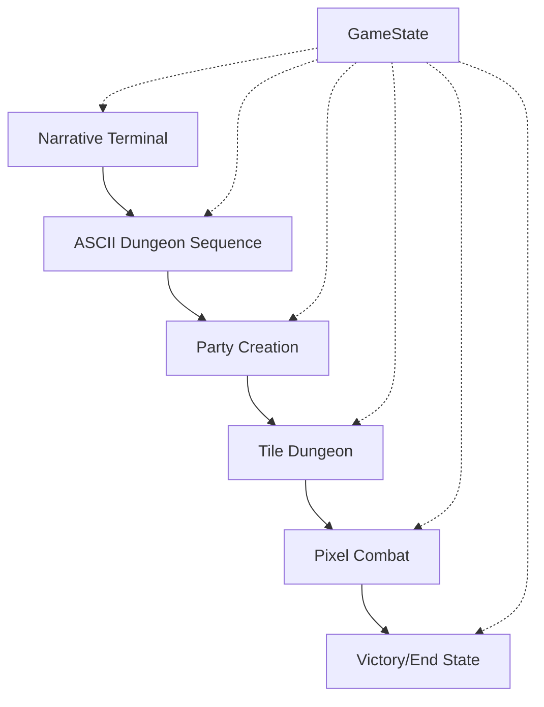

# Data Model: Ωmega Spiral Game Architecture

## Core Entities

### GameState (Root Entity)
Central game state container that persists across all scenes and manages global game progression.

```csharp
public class GameState
{
    // Scene progression
    public int CurrentScene { get; set; } = 1;
    public string CurrentScenePath { get; set; } = "res://Source/Scenes/Scene1Narrative.tscn";

    // Player identity and narrative thread
    public string PlayerName { get; set; } = "";
    public DreamweaverThread DreamweaverThread { get; set; } = DreamweaverThread.Hero;
    public string PlayerSecret { get; set; } = "";

    // Dreamweaver alignment system
    public Dictionary<DreamweaverType, int> DreamweaverScores { get; set; } = new()
    {
        [DreamweaverType.Light] = 0,
        [DreamweaverType.Mischief] = 0,
        [DreamweaverType.Wrath] = 0
    };
    public DreamweaverType? SelectedDreamweaver { get; set; } = null;

    // Party and character data
    public PartyData PlayerParty { get; set; } = new();

    // Inventory and progression
    public List<string> CollectedShards { get; set; } = new();
    public Dictionary<string, object> SceneProgress { get; set; } = new();

    // Save/load metadata
    public DateTime LastSaveTime { get; set; } = DateTime.Now;
    public string SaveVersion { get; set; } = "1.0.0";
}
```

### Dreamweaver System
Core alignment mechanic that influences narrative and gameplay throughout the game.

```csharp
public enum DreamweaverType
{
    Light,      // Hero thread - sacrifice and wisdom
    Mischief,   // Ambition thread - chaos and transformation
    Wrath       // Shadow thread - power and consequence
}

public enum DreamweaverThread
{
    Hero,       // Light-aligned choices
    Shadow,     // Wrath-aligned choices
    Ambition    // Mischief-aligned choices
}

public class DreamweaverChoice
{
    public string Id { get; set; }
    public string Text { get; set; }
    public string Description { get; set; }
    public DreamweaverThread Thread { get; set; }
    public Dictionary<DreamweaverType, int> AlignmentBonus { get; set; }
}
```

### Party System
Classic CRPG party creation and management system.

```csharp
public class PartyData
{
    public List<Character> Members { get; set; } = new();
    public int Gold { get; set; } = 0;
    public Dictionary<string, int> Inventory { get; set; } = new();
}

public class Character
{
    public string Name { get; set; }
    public CharacterClass Class { get; set; }
    public CharacterRace Race { get; set; }
    public CharacterStats Stats { get; set; }
    public int Level { get; set; } = 1;
    public int Experience { get; set; } = 0;
}

public enum CharacterClass
{
    Fighter, Mage, Priest, Thief, Bard, Paladin, Ranger
}

public enum CharacterRace
{
    Human, Elf, Dwarf, Gnome, Halfling, HalfElf
}

public class CharacterStats
{
    public int Strength { get; set; }
    public int Intelligence { get; set; }
    public int Wisdom { get; set; }
    public int Dexterity { get; set; }
    public int Constitution { get; set; }
    public int Charisma { get; set; }
    public int Luck { get; set; }
}
```

## Scene Data Models

### Narrative Terminal Scene
JSON-driven dialogue system with branching narratives and player choice tracking.

```csharp
public class NarrativeSceneData
{
    public string Type { get; set; } = "narrative_terminal";
    public List<string> OpeningLines { get; set; } = new();
    public NarrativeChoice InitialChoice { get; set; }
    public List<StoryBlock> StoryBlocks { get; set; } = new();
    public string NamePrompt { get; set; }
    public SecretQuestion SecretQuestion { get; set; }
    public string ExitLine { get; set; }
}

public class NarrativeChoice
{
    public string Prompt { get; set; }
    public List<DreamweaverChoice> Options { get; set; } = new();
}

public class StoryBlock
{
    public List<string> Paragraphs { get; set; } = new();
    public string Question { get; set; }
    public List<ChoiceOption> Choices { get; set; } = new();
}

public class ChoiceOption
{
    public string Text { get; set; }
    public int NextBlock { get; set; }
}
```

### ASCII Dungeon Sequence
Three interconnected dungeons with object interaction and alignment scoring.

```csharp
public class DungeonSequenceData
{
    public string Type { get; set; } = "ascii_dungeon_sequence";
    public List<DungeonRoom> Dungeons { get; set; } = new();
}

public class DungeonRoom
{
    public DreamweaverType Owner { get; set; }
    public List<string> Map { get; set; } = new();
    public Dictionary<char, string> Legend { get; set; } = new();
    public Dictionary<char, DungeonObject> Objects { get; set; } = new();
    public Vector2I PlayerStartPosition { get; set; } = new(2, 2);
}

public class DungeonObject
{
    public ObjectType Type { get; set; }
    public string Text { get; set; }
    public DreamweaverType AlignedTo { get; set; }
    public Vector2I Position { get; set; }
}

public enum ObjectType
{
    Door, Monster, Chest
}
```

### Tile Dungeon Scene
2D tile-based dungeon exploration with classic JRPG movement and interaction.

```csharp
public class TileDungeonData
{
    public string Type { get; set; } = "tile_dungeon";
    public List<string> Tilemap { get; set; } = new();
    public Dictionary<char, TileDefinition> Legend { get; set; } = new();
    public DungeonUI UI { get; set; }
    public string Controls { get; set; }
    public string ExitCondition { get; set; }
}

public class TileDefinition
{
    public TileType Type { get; set; }
    public bool Walkable { get; set; }
    public bool Interactable { get; set; }
    public string Description { get; set; }
}

public enum TileType
{
    Wall, Floor, Door, Key, Treasure, Exit
}

public class DungeonUI
{
    public bool ShowInventory { get; set; }
    public bool ShowMap { get; set; }
    public List<string> ShowStats { get; set; } = new();
}
```

### Pixel Combat Scene
Turn-based combat system with JRPG mechanics and sprite-based rendering.

```csharp
public class CombatSceneData
{
    public string Type { get; set; } = "pixel_combat";
    public string PlayerSprite { get; set; }
    public CombatEnemy Enemy { get; set; }
    public List<string> Actions { get; set; } = new();
    public string Music { get; set; }
    public string VictoryText { get; set; }
}

public class CombatEnemy
{
    public string Name { get; set; }
    public int HP { get; set; }
    public int MaxHP { get; set; }
    public int Attack { get; set; }
    public int Defense { get; set; }
    public string Sprite { get; set; }
    public List<string> AttackPatterns { get; set; } = new();
}
```

## Data Flow Architecture

### Scene Transition Flow


### JSON Schema Validation
All scene data files are validated against their respective schemas before loading:

- `scene1_narrative/schema.json` - Narrative terminal validation
- `scene2_nethack/schema.json` - Dungeon sequence validation
- `scene3_wizardry/schema.json` - Party creation validation
- `scene4_tile_dungeon/schema.json` - Tile dungeon validation
- `scene5_ff_combat/schema.json` - Combat scene validation

### Save Data Structure
Game saves are stored as JSON with the following structure:

```json
{
  "version": "1.0.0",
  "timestamp": "2025-10-07T20:02:06Z",
  "gameState": {
    "currentScene": 1,
    "playerName": "Player",
    "dreamweaverThread": "hero",
    "dreamweaverScores": {
      "light": 0,
      "mischief": 0,
      "wrath": 0
    },
    "partyData": { ... },
    "collectedShards": [],
    "sceneProgress": { ... }
  }
}
```

## Data Relationships

### Entity Relationships
- **GameState** contains one **PartyData** and manages multiple **Scene** instances
- **DungeonRoom** belongs to one **DreamweaverType** and contains multiple **DungeonObject**
- **Character** has one **CharacterClass**, one **CharacterRace**, and one **CharacterStats**
- **CombatSceneData** references one **CombatEnemy** and multiple **CombatAction**
- **NarrativeSceneData** contains multiple **StoryBlock** and **DreamweaverChoice**

### State Persistence Strategy
- **Runtime State**: Stored in memory via GameState singleton, lost on application close
- **Persistent State**: Serialized to JSON files in user:// directory, survives application restarts
- **Scene Data**: External JSON files loaded at runtime, content updates don't require rebuild
- **Asset Data**: Godot resource files (.tres) for textures, audio, and other binary assets

## Data Validation Rules

### Business Logic Constraints
- Party must have exactly 3 members before proceeding to tile dungeon
- Dreamweaver scores must be calculated correctly (+2 for owner match, +1 for cross-alignment)
- Player name cannot be empty or contain special characters
- Combat HP values must never exceed maximum values
- Scene progression must follow the defined sequence (1→2→3→4→5)

### Technical Validation
- All JSON files must validate against their respective schemas
- Required fields must be present and non-null
- Numeric values must be within acceptable ranges
- String values must not exceed maximum lengths
- File paths must reference existing resources

This data model provides a solid foundation for the Ωmega Spiral game's architecture, ensuring type safety, data integrity, and maintainable code structure throughout the implementation.